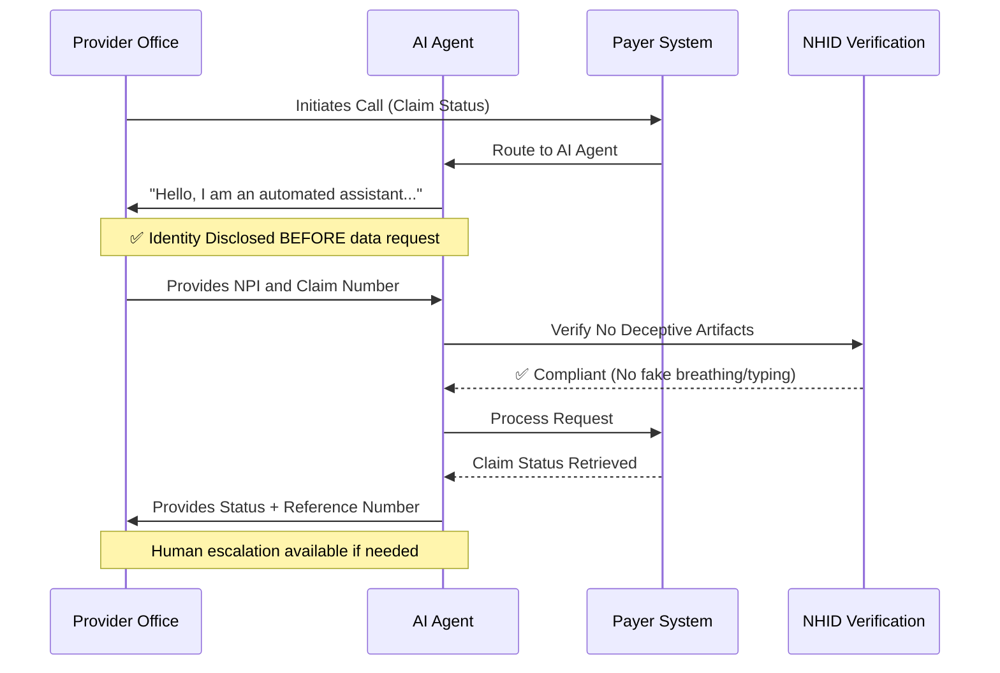

# NHID-Clinical v1.1

**Non-Human Identity Disclosure Standard for Healthcare Voice Workflows**

> [!IMPORTANT]
> **🚧 v1.2 Drafting in Progress**
> We are currently resolving architectural gaps identified in v1.1, including SIP Header Identity, Failover Logging, and Bot-to-Bot Deadlocks.
> [**View the v1.2 Working Draft**](v1.2-draft.md) to see the proposed technical specifications.

---

## 🎯 What Problem Does This Solve?

Picture this: You're a medical office assistant calling an insurance company to check a claim status. A friendly voice answers: *"Hi, this is Sarah!"* 

You spend 3 minutes explaining the situation. "Sarah" keeps saying *"Mmm-hmm, let me check that..."* with realistic typing sounds in the background.

Then suddenly: *"I'm sorry, I didn't understand. Can you repeat the member ID?"*

**Plot twist: "Sarah" was an AI agent the entire time.**

You just wasted 3 billable minutes—and you're frustrated, confused, and now questioning if your data was even recorded correctly.

**This happens thousands of times per day across healthcare.**

Welcome to **"Impersonation Latency"**—the operational black hole where nobody knows who (or what) they're talking to.

---

## 🩺 Abstract

**NHID-Clinical** defines a minimum control baseline for non-human identity disclosure in B2B healthcare voice interactions.

The standard addresses a documented gap between existing consumer-protection laws, healthcare privacy regulations, and real-world payer–provider administrative workflows. It specifically targets **"Impersonation Latency"**—the operational waste and security risk caused when a human provider cannot immediately distinguish an AI agent from a human counterpart.

> **Scope Note:** This standard is built for **B2B Administrative Workflows** (Provider-to-Payer, Business Associate-to-Payer). It does *not* currently cover direct-to-consumer or patient-facing clinical triage scenarios.

---

## 📰 In the Media

**The Next Gen Tech Insider** | January 12, 2026  
[**"NHID-Clinical v1.1 Addresses AI Agent Challenges in Healthcare Payer Interactions"**](https://thenextgentechinsider.com/pulse/nhid-clinical-v11-addresses-ai-agent-challenges-in-healthcare-payer-interactions)  

> *"A new open-source governance standard... aims to resolve operational and compliance challenges in AI agent interactions... tackling risks of unauthorized access to patient data."*

**Recognition:** Featured by Aaira AI Research Assistant as a notable innovation in healthcare AI governance.

---

## 💡 How NHID-Clinical Works

**The "Green Lane" Principle:** When AI agents identify themselves upfront and follow the rules, everyone wins:
- **Providers** save time (no "are you human?" loops)
- **Payers** reduce operational costs (faster calls)
- **Patients** get faster service (providers aren't stuck on hold)
- **Compliance teams** sleep better (clear audit trails)

---

## 🚨 The Problem Statement

In current healthcare operations, AI voice agents are commonly deployed for eligibility checks, claim status inquiries, and administrative routing. **But here's what's actually happening:**

❌ **What's Broken:**
* AI agents don't disclose their non-human identity unless explicitly challenged
* Disclosure is *reactive* (after you ask "Are you a robot?") rather than *proactive*
* Providers waste billable time playing "Guess Who: Human or Bot Edition"
* Some agents use fake breathing sounds and "umm..." pauses to seem more human

✅ **What NHID-Clinical Fixes:**
* **Pre-Data Exchange Gate:** AI must identify itself *before* asking for any sensitive data
* **No Deceptive Artifacts:** No fake breathing, typing sounds, or misleading human names
* **Clear Escalation Path:** When humans need humans, there's a guaranteed way out

**The Cost:** Healthcare providers report authentication failures cost the industry **$40M+ annually** in wasted operational time and blocked AI deployments.

---

## 🎭 Positioning: This Isn't Just Another Framework

**What NHID-Clinical is:**
- ✅ A **voluntary** governance standard with binary, testable requirements
- ✅ Operational logic gates that QA teams can actually implement
- ✅ Designed by someone who spent 8 months enforcing HIPAA compliance in actual payer operations

**What NHID-Clinical is NOT:**
- ❌ A replacement for HIPAA, GDPR, or other legal requirements
- ❌ An "ethical AI" philosophy paper with no implementation guidance
- ❌ A certification program (yet—though that's on the roadmap)

**Think of it like this:** HIPAA says "protect patient data." NHID-Clinical says "here's *exactly* how to do that when AI agents are involved in voice workflows."

---

## 📜 Regulatory Context & Compatibility

NHID-Clinical operates at the **operational layer**, complementing existing legal frameworks without conflict:

| Framework | What It Does | How NHID-Clinical Fits |
|-----------|-------------|----------------------|
| **HIPAA** | Protects patient health information | NHID ensures the "Minimum Necessary" standard applies to the *correct entity type* (human vs. machine) |
| **TCPA / FCC** | Governs outbound call consent | NHID manages *inbound* handshake content to prevent deceptive practices in B2B calls |
| **California B.O.T. Act** | Requires bot disclosure in consumer contexts | NHID extends this spirit to private healthcare administrative channels not explicitly covered |
| **NIST AI RMF** | Framework for AI risk management | NHID operationalizes GOVERN, MAP, MEASURE, and MANAGE functions (see alignment table below) |

---

## 🛡️ The Standard (The Actual Rules)

### 1. 🚪 Proactive Identity Assertion (PIA)

**The Rule:**
All non-human voice agents must proactively disclose their non-human identity **during the initial greeting** and **prior to the solicitation or intake of any operational data** (e.g., NPI, Member ID, Claim Number).

**Why "Pre-Data Exchange" Matters:**
Instead of saying "you must disclose within 3 seconds" (which fails in laggy VoIP calls), we say: **"Disclose BEFORE asking for sensitive data."** This is auditable, technology-agnostic, and accounts for real-world latency.

**✅ Compliant Example:**
> *"Hello, I am an automated assistant for BlueCross Claims. I can help you with status and eligibility. To begin, please say the NPI."*

**❌ Non-Compliant Example:**
> *"Hello, this is Sarah. Can I get the NPI?"*
> 
> **Violation:** Uses a human name without qualification AND requests data before disclosure.

---

### 2. 🎭 Prohibition of Deceptive Artifacts ("The Turing Boundary")

**The Rule:**
Agents must not employ synthetic audio artifacts that serve no communicative function other than to imply biological presence or mask processing latency.

**Translation:** Stop making your bots pretend to breathe.

**❌ Prohibited "Masking" Techniques:**
| Deceptive Artifact | Why It's Banned | Compliant Alternative |
|-------------------|-----------------|----------------------|
| Synthetic breathing sounds | Implies human biology | Natural prosody/pacing |
| Fake keyboard typing | Implies human is "working" | "Searching the system..." |
| Scripted "umm..." sounds | Masks processing latency | "One moment while I retrieve that..." |
| Human name without qualification | Creates false assumption | "This is Alex, an automated assistant..." |

**✅ What's ALLOWED (and encouraged):**
- Natural prosody and conversational tone
- Clear inflection and pacing for comprehension
- Professional, friendly language

**The Principle:** If an audio element serves no communicative purpose except to trick someone into thinking you're human—it's banned.

---

### 3. 🆘 Escalation & Safe Failover

**The Rule:**
When a human stakeholder explicitly requests a transfer or indicates the agent is failing to understand:

1.  **Immediate Acknowledgement:** *"I understand you need to speak to a specialist."*
2.  **Context Preservation:** Generate a reference number so the human doesn't have to re-explain everything
3.  **Safe Failover:**
    * ✅ **If human staff available:** Transfer immediately
    * 🌙 **If after hours:** State hours of operation + offer voicemail/callback

**❌ What's NOT Allowed:**
- Infinite "I didn't understand" loops
- Sudden disconnection without explanation
- Forcing callers to restart from scratch

---

## 📊 Audit & Evidence Requirements

**You don't need fancy compliance software.** Here's what counts as proof:

### Tier 1 (Minimum Required):
- **Transaction Log:** Text log showing "Identity Disclosed" timestamp vs. "Data Request" timestamp
- **Script Version Control:** Documentation proving the disclosure language was in production

### Tier 2 (Recommended):
- **Audio Snippet:** First 30 seconds of call recording (subject to your retention policies)

**The Goal:** Make compliance auditable without creating operational burden.

---

## 📈 Success Metrics

How do you know if NHID-Clinical is working?

| Metric | What It Measures | Target |
|--------|-----------------|--------|
| **Disclosure Failure Rate (DFR)** | % of calls where data was requested *before* identity disclosure | <2% |
| **Escalation Loop Count** | Frequency of "agent... agent... AGENT!" frustration | <1 per 100 calls |
| **Average Handle Time (AHT)** | Reduction in call duration due to eliminating "are you a bot?" verification | -15-30 seconds |
| **Provider Satisfaction** | Post-call feedback from office staff | >85% positive |

---

## 🎯 NIST AI RMF Alignment

For the compliance nerds (said with love—I am one):

| AI RMF Function | Category | NHID-Clinical Alignment |
|----------------|----------|------------------------|
| **GOVERN** | GOV 1.5 – Risk Management | Defines "impersonation latency" as a specific operational risk |
| **MAP** | MAP 3.4 – Human-AI Interaction | Establishes boundaries where synthetic voice cannot deceive humans |
| **MEASURE** | MEAS 2.6 – Transparency | Introduces quantifiable metrics (DFR) to evaluate disclosure |
| **MANAGE** | MAN 4.1 – Post-Deployment Monitoring | Requires audit artifacts and logs for ongoing oversight |

---

## 🚧 Known Gaps & Future Scope

**What v1.1 DOES NOT Cover (yet):**

- ⏳ **Patient-facing workflows:** Direct-to-consumer or clinical triage
- 📞 **Outbound calls:** Payer-initiated or proactive agent calls  
- 🌍 **International compliance:** GDPR or non-U.S. regulatory contexts
- ♿ **Accessibility:** Multilingual support, deaf/hard-of-hearing accommodations
- 🔗 **Multi-entity integrations:** Complex scenarios with multiple payers/vendors
- 🏛️ **Enforcement mechanisms:** Certification, audit standards, adoption incentives

**Translation:** This is v1.1, not the final word on AI identity in healthcare. We're building iteratively based on real operational feedback.

---

## 🗺️ v1.2 Roadmap

Based on community feedback, here's what we're tackling next:

| Issue | Category | Priority | Why It Matters |
|-------|----------|---------|---------------|
| **Bot-to-Bot Standoff** | Architecture | 🔴 High | What happens when two AI agents call each other? (Spoiler: infinite loop) |
| **Technical Signaling** | Optimization | 🟡 Medium | SIP headers could make disclosure machine-readable |
| **Interrupt/Barge-In** | Operational | 🔴 High | Common real-world failure: "LET ME TALK TO A HUMAN!" |
| **Context Preservation** | Operational | 🟡 Medium | Passing conversation history to human agents |
| **Failover Liability** | Compliance | 🔴 High | Who's responsible if AI fails to escalate properly? |

**📅 Target Release:** Q2 2026 (after 30-60 days of public comment on v1.1)

**🐛 Track Progress:** [View v1.2 Issues](https://github.com/thankcheeses/NHID-Clinical/issues)

---

## 🤝 How to Contribute

This is an **open standard**—your input makes it better.

**We're looking for:**
- 💬 **Technical feedback** on implementation feasibility
- 🏥 **Real-world experience** from healthcare IT teams
- ⚖️ **Compliance perspective** from HIPAA officers and payer operations
- 🐛 **Edge cases** we haven't thought of yet

**How to participate:**
1. 🗣️ [Open a GitHub Discussion](https://github.com/thankcheeses/NHID-Clinical/discussions) for questions
2. 🐛 [File an Issue](https://github.com/thankcheeses/NHID-Clinical/issues) for specific problems
3. 📧 Email feedback to: [bnbaynard@gmail.com](mailto:bnbaynard@gmail.com)

---

## 📄 License

This work is licensed under **Creative Commons Attribution 4.0 International (CC-BY 4.0)**.

**What this means:**
- ✅ You can use it commercially
- ✅ You can modify it for your organization
- ✅ You can share it freely
- ⚠️ You must give credit to the original author

**Author:** Brianna Baynard  
**Repository:** [github.com/thankcheeses/NHID-Clinical](https://github.com/thankcheeses/NHID-Clinical)  
**Portfolio:** [ai-governance-map.vercel.app](https://ai-governance-map.vercel.app)

---

## 📚 Changelog

### v1.1 (Current - Candidate)
- ✨ Shifted from "3-second window" to **"Pre-Data Exchange gate"** for better auditability
- 📝 Added "Known Gaps & Future Scope" for transparency
- 🎯 Refined positioning to emphasize governance best practice over regulatory equivalence
- 🎭 Clarified distinction between natural prosody (good) and deceptive artifacts (bad)
- 📊 Added success metrics and audit requirements

### v1.0 (Initial Draft)
- 🚀 Initial release with temporal disclosure requirements
- 🗺️ NIST/HIPAA alignment mapping

---

## 🙏 Acknowledgments

This standard was developed based on operational experience at:
- **United Concordia Dental / Highmark Health** (TRICARE/ADDP operations)
- **Pennsylvania Higher Education Assistance Agency** (Federal Student Aid compliance)
- **Scientific Games** (Regulated gaming systems)

Special thanks to the healthcare IT community for feedback during early drafts, and to the NIST AI RMF team for providing the governance framework that made this operationalization possible.

---

**Built with ❤️ by someone who spent too many hours asking "Wait, am I talking to a robot?"**

*Let's make healthcare AI transparent, trustworthy, and a little less frustrating.*